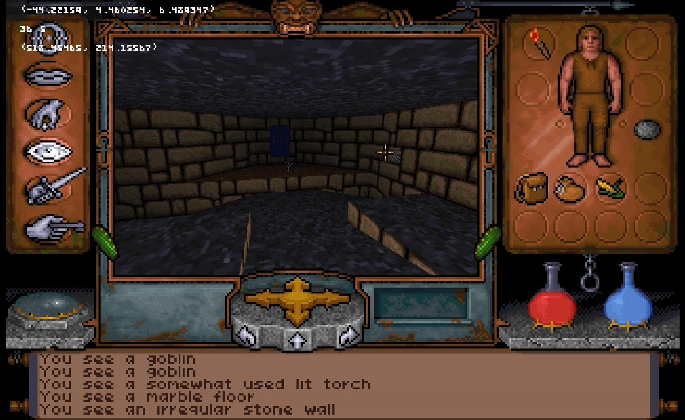
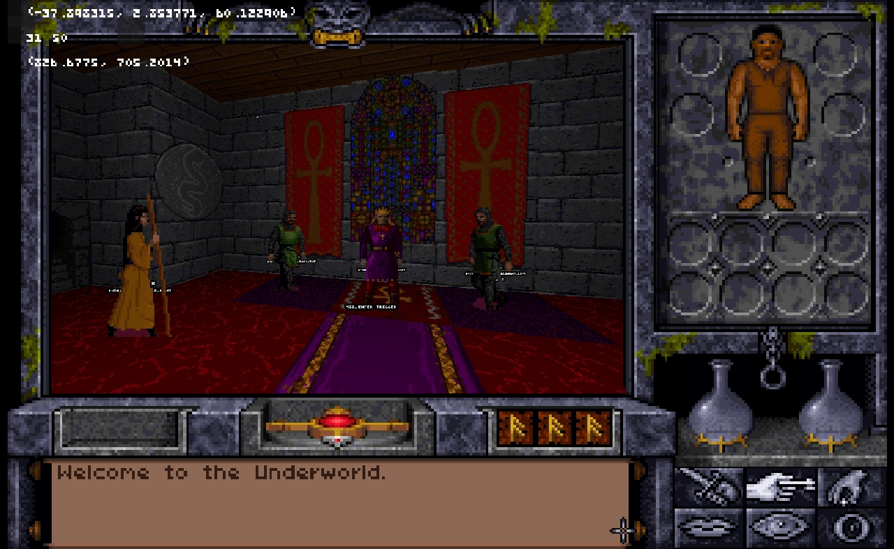
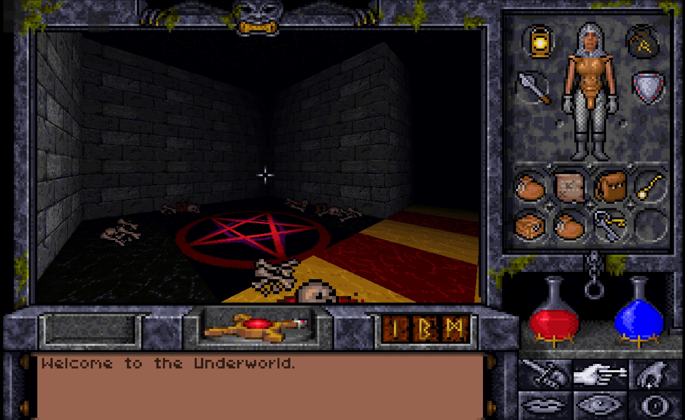
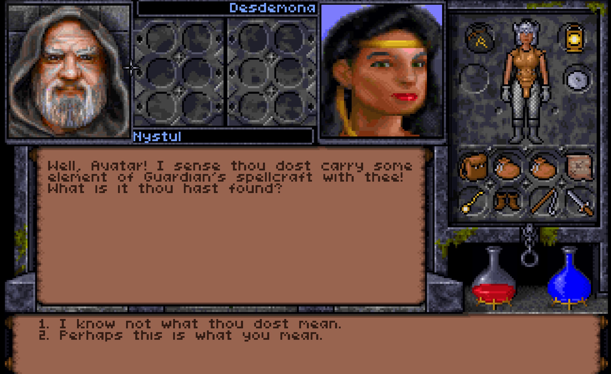
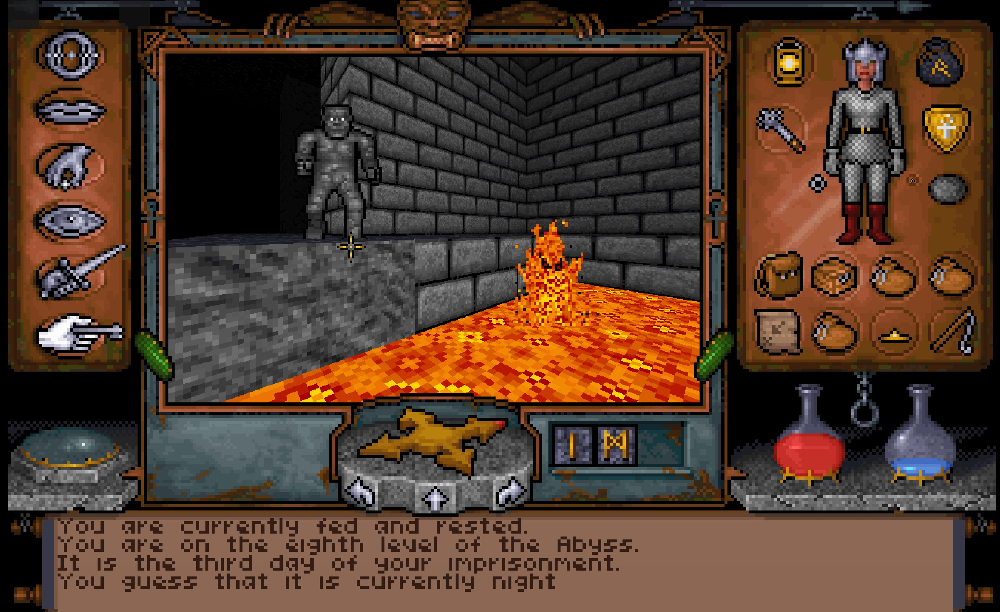

# UnderworldGodot

- [UnderworldGodot](#underworldgodot)
  - [Overview](#overview)
  - [Credits](#credits)
  - [Before you begin.](#before-you-begin)
  - [Current features](#current-features)
  - [Whats missing](#whats-missing)
  - [Known Issues](#known-issues)
  - [Getting Started](#getting-started)
  - [UWsettings.json](#uwsettingsjson)
  - [Controls](#controls)
    - [Movement](#movement)
    - [Modes](#modes)
    - [Cheats](#cheats)
- [Appendix](#appendix)
  - [Guide to the Underworld and Reverse Engineering](#guide-to-the-underworld-and-reverse-engineering)
  - [Sources/Previous Projects](#sourcesprevious-projects)
    - [Sources (taken from my Guide to the Underworlds)](#sources-taken-from-my-guide-to-the-underworlds)
      - [Also referenced](#also-referenced)
      - [Credits](#credits-1)
        - [Credits from the Abysmal Project](#credits-from-the-abysmal-project)
        - [Credits from the Underworld Adventures Project](#credits-from-the-underworld-adventures-project)
        - [Other contributions to this document](#other-contributions-to-this-document)

## Overview
An engine recreation of Ultima Underworld and Ultima Underworld 2 in the Godot Engine.

This project supercedes the Unity-based project and reboots the code base to act more like the Underworld games originally worked.







## Credits
This project is largely based on the previous reverse engineering work undertaken by various groups and individuals over the years. Without their efforts this project would not be possible please see the appendix below for the credits I have been able to attribute. If I have failed to give proper credit please let me know and I will happily correct this document.

## Before you begin.
This is currently pre-alpha. No support is provided for it and usage is at your own risk. Please don't download this version and expect it to be usable in anyway. Think of it as a interactive map viewer with a lot of game logic implemented

Requires game files for either UW1 or UW2. GOG versions need to be extracted using a zip extracter (eg 7-Zip) from the game.gog file


## Current features
* Map loading
* Animated doors and sprites
* Looping NPC animations
* Full Conversations with NPCs
* Almost all game triggers and traps.
* Barter logic
* Lighting effects (Palette based except for correct transparencies)
* Inventory management including runebag (excluding drag and drop)
* Picking up and dropping of items (without checking pickup rules)
* Usable switches
* Reading signs
* Game strings
* Palette cycling and shading
* Save file loading
* Player stats display
* HP and Mana Displays
* Compass status message
* 3D Models
* Food consumption
* Spell casting. Most spells implemented.
* Usable wands, scrolls and potions.
* Small window cutscenes (partial)
* Game variables and quest variables (partial support, not all scenarios may work)
* Level transitions
* Partial options menu. In game loading of saves
* Many Object interactions
* Combat attack charge buildup and combat accuracy calcuations for player
* Missile combat
* In game advancement and player status changes over time (hunger, fatigue, mana regeneration)
* Skillpoints and character advancement logic
* Automap navigation and updating
* Read-only automap notes.
* Processing of SCD.ARK events (Scheduled events in UW2)
* Partial cutscene support
* Sleeping and dream logic
* Character creation
* Mostly complete Object physics
* Most NPC AI, movement and pathfinding
* NPC Combat Actions
* Player movement and collision (with a lot of jank attached incl framerate/speed issues)

## Whats missing

* Sound and music
* Sprite transparencies
* Saving  
* Cutscene bitmap scrolling
* Those weird ethereal void monsters
* Animated Dragon UI Elements
* Endgame screens
* Editing of automap notes
* Weight and encumberance mechanics
* Swimming
* Getting lost mechanics
* Stealth mechanics (partial)
* Splash screens and game credits
and much more!

## Known Issues
* Some NPC sprites are incorrectly cropped.
* Player motion is sluggish (timing need tuning)
* Some cutscenes are missing frames or have visual distortions
* Enter/Exit/Pressure triggers currently not working

## Getting Started

No exe builds yet. This is just a glorified map viewer at this point that you will need to build in Godot yourself.

See [https://godotengine.org/](https://godotengine.org/) for engine runtime downloads.

1. Clone the repository
2. Install the Godot engine (version 4.3-stable) from https://godotengine.org/ and run it.
3. Save a file called ``uwsettings.json`` in the Godot Folder. See below for format of the file
4. Godot project will open at ``LaunchScene.tscn``. IMPORTANT: Make sure you run BUILD on the project before continuing.
5. Run. It might work

This project is developed using VSCode using the C# Tools for Godot extensions. If you are configured to use Godot in VSCode then the project can alos just be compiled and ran from there.

## UWsettings.json

Enter optional paths for each game. Select the folder with the .exe file.
If using the gog versions extract the file ``game.gog`` using a tool like 7-zip and point to that folder.

To select maps to load.
1. Choose the game mode by editing the gametoload param in the file ``uwsettings.json``. This file should be located in the same path as Godot or a built exe.
   1.  UW1 or UW2 are the valid values.
2. Enter the level number. Values start at 0.
3. Other values
   1. Light level- Shading in a range 0-7. Value is ignored
   2. levarkfolder - Change from ``DATA`` to ``SAVE1`` to ``SAVE4`` to load savegames.
   3. Shader - Default shader used. Value is ignored

```json
{
    "pathuw1": "C:\\Games\\UW1\\game\\UW",
    "pathuw2": "C:\\Games\\UW2IDA\\UW2",
    "gametoload": "UW2",
    "level": 0,
    "lightlevel" : 7,
    "levarkfolder" : "DATA",
    "shader" : "UWSHADER"
}
```


## Controls
Note controls are sluggish due to ongoing implementation and debugging of player motion.

### Movement
W run forward
Shift+W walk forward
S walk backwards
AD strafe left and right
QE turn left and right
T to toggle freemouse
RF fly up and down when a magic fly/levitate spell is active

### Modes
F1-F6 Change interaction modes
F7 Toggle inventory panels
F8 Cast Spell
F9 Use Track Skill
F10 Make camp and go to sleep.
F11 Toggle Position label
F12 Debug process SCD.ARK events

### Cheats
Tilde (~) Give all runestones, 30 mana and maximise mage skills.


# Appendix
## Guide to the Underworld and Reverse Engineering
See  [https://github.com/hankmorgan/UWReverseEngineering] for my dissassemblies and notes on UW1/UW2

## Sources/Previous Projects

### Sources (taken from my Guide to the Underworlds)
The information in this document is gathered from a number of sources most notably the vernable uw-formats.txt. Sections of this document if not taken directly from UW-Formats.txt are heavily based on the work that has gone into that document by a number of contributors and groups over the years. Every effort is being made to list this contributions here. To avoid missing anyone I am quoting verbatim the credit section of each copy of uw-formats.txt I can referencing.

Unfortunately some information sources have been lost to me over time. If I have missed a reference or not given due credit for research or code examples then please let me know and I will happily correct the record.

#### Also referenced

Unknown authors [Internal Formats on the Ultima Codex](https://wiki.ultimacodex.com/wiki/Ultima_Underworld_internal_formats) 

Mitch Aigner FAQs for [UW1](https://gamefaqs.gamespot.com/pc/562665-ultima-underworld-the-stygian-abyss/faqs/1811) abd [UW2](https://gamefaqs.gamespot.com/pc/564592-ultima-underworld-ii-labyrinth-of-worlds/faqs/1813)

#### Credits
The following credits are taken verbatim from the files shared by named projects.

The "me" mentioned in the credits is not the author of this guide.

##### Credits from the Abysmal Project
   My thanks go out to Jim Cameron that started the original "uw-specs.txt"
   file and subsequently found out more unknown data structures and discussed
   about file formats with me. Many thanks, Jim!

   Additional information came from
   Alistair Brown (basic object format, via the Underworld II editor available at
   <http://bearcity.pwp.blueyonder.co.uk/>)
   Ulf Wohlers (Objects and 3D models).
   Fabian Pache (about map details and 3d models, ``UW2`` conversations
   ``UW2`` player save <http://uw2rev.sourceforge.net>).

   Further infos about weapon animation and miscellaneous bits about uw were
   contributed by Telemachos from peroxide.dk.

   I also like to thank Telemachos who pointed me to the TSSHP's file formats
   file at the start of all of this.

   This file is probably:
   Copyright (c) 2008,2009 Julien Langer
   Copyright (c) 2002,2008,2009 Fabian Pache
   Copyright (c) 2000,2001,2002,2003 Jim Cameron
   Copyright (c) 2002,2003,2004 Michael Fink
   Copyright (c) 2004 Kasper Fauerby

##### Credits from the Underworld Adventures Project
   My thanks go out to Jim Cameron that started the original "uw-specs.txt"
   file and subsequently found out more unknown data structures and discussed
   about file formats with me. Many thanks, Jim!

   Additional information came from Alistair Brown (basic object format, via
   the Underworld II editor available at
   <http://bearcity.pwp.blueyonder.co.uk/>), Ulf Wohlers (Objects and 3D
   models) and Fabian Pache (about map details and 3d models, ``UW2`` related,
   http://uw2rev.sourceforge.net).

   Further infos about weapon animation and miscellaneous bits about uw were
   contributed by Telemachos from peroxide.dk.

   I also like to thank Telemachos who pointed me to the TSSHP's file formats
   file at the start of all of this.

   This file is probably:
   Copyright (c) 2000,2001,2002,2003 Jim Cameron
   Copyright (c) 2002,2003,2004 Michael Fink
   Copyright (c) 2004 Kasper Fauerby

##### Other contributions to this document
[KarlClinckspoor](https://github.com/KarlClinckspoor) on ``cmb.dat``
Information on cutscene animation commands from khedoros at https://github.com/khedoros/uw-engine/blob/master/csparse.cpp
